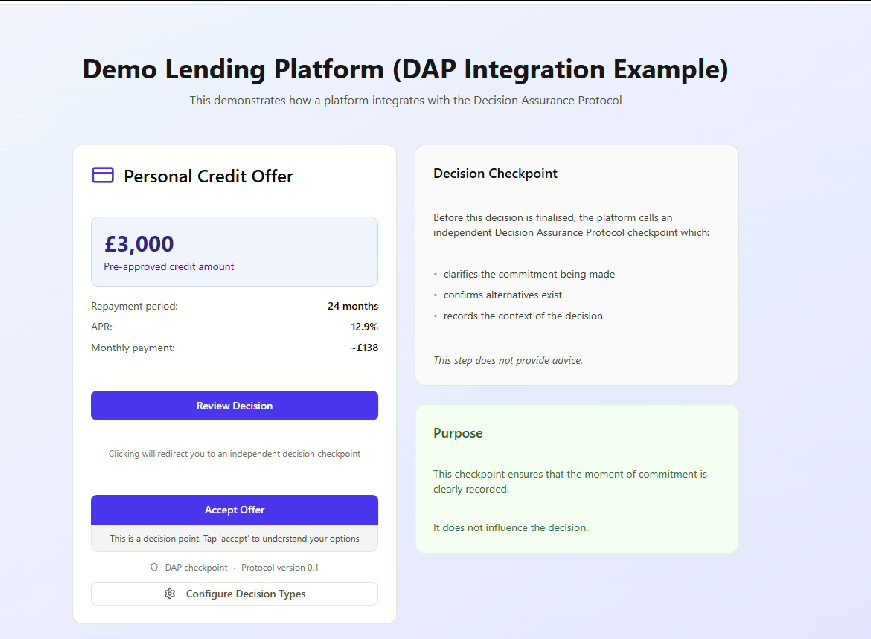
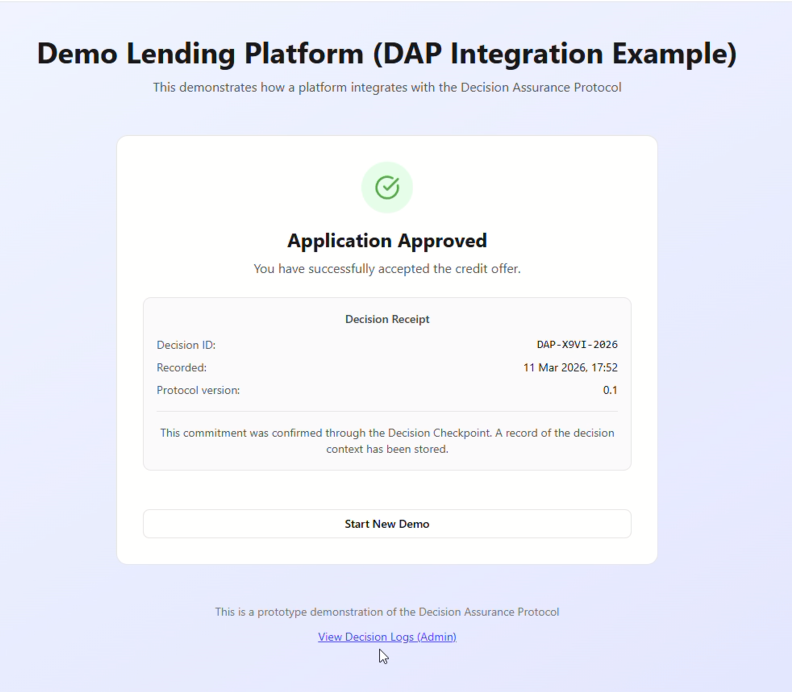
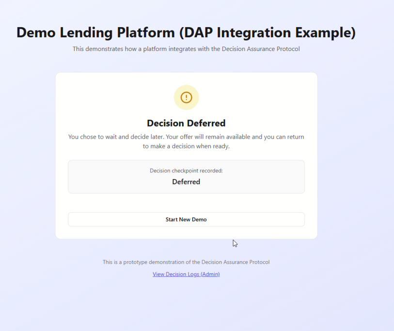
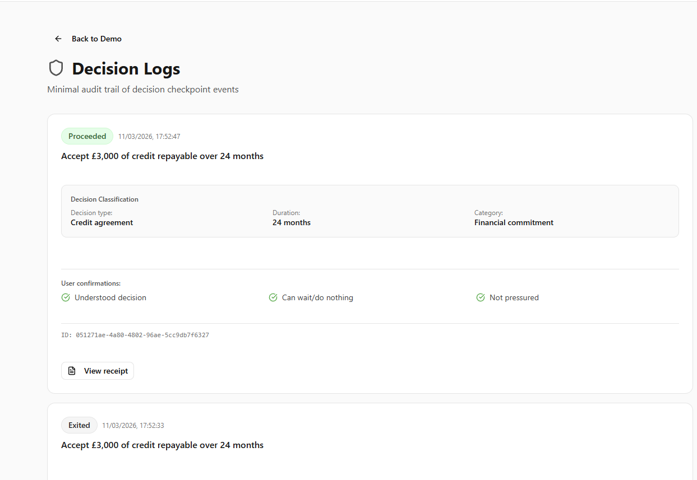

# Decision Assurance Protocol (DAP)

A thin, auditable standard for recording consequential digital decisions.

Decision Assurance Protocol (DAP) introduces a neutral checkpoint at the moment a user commits to a significant action online.  
The checkpoint clarifies the commitment being made, confirms that alternatives exist, and records the context of the decision in a structured and auditable form.

DAP does not provide advice, recommendations, or behavioural nudges.  
Its purpose is simply to ensure that the moment of commitment is legible, voluntary, and recordable.

---

## Why DAP exists

Digital systems are extremely good at recording **transactions**.

They reliably capture:

- payments  
- identity verification  
- fraud signals  
- authentication events  

However, they are surprisingly weak at recording **the moment a person commits to a consequential decision**.

Examples include:

- accepting credit or long-term financial commitments  
- subscribing to recurring payments  
- granting significant data permissions  
- entering contractual agreements online  

In most digital journeys, the context surrounding these decisions is difficult to reconstruct later.

DAP introduces a lightweight, standardised checkpoint to ensure that the **decision context is recorded at the moment of commitment**.

---

## Core functions

A DAP checkpoint performs four simple functions.

1. **Name the decision clearly**

   The commitment being made is presented in plain language.

2. **Make alternatives explicit**

   Proceeding, reducing scope, delaying, or taking no action are all legitimate outcomes.

3. **Maintain strict neutrality**

   The checkpoint provides no advice, optimisation, or persuasion.

4. **Create an auditable record**

   The decision context and outcome are recorded in a structured form.

---

## Protocol flow

A typical integration follows this sequence.

Platform
↓
User initiates commitment
↓
DAP Decision Checkpoint
↓
User confirms or selects alternative
↓
Decision receipt generated
↓
Return to platform with outcome

DAP acts as a thin verification layer between **intent and commitment**.

---

## Example checkpoint

Below is a reference implementation of a decision checkpoint.

The checkpoint clarifies:

- the commitment being made  
- the implications of that commitment  
- the legitimate alternatives available  

The user may then confirm or choose an alternative outcome.

---

## Possible outcomes

A DAP checkpoint can produce several outcomes.

| Outcome | Description |
|-------|-------------|
| **Confirmed** | The user confirms the commitment |
| **Reduced scope** | The user chooses a smaller commitment |
| **Deferred** | The user chooses to wait |
| **Cancelled** | The user exits the decision |

Each outcome is recorded as part of the decision log.

---

## Decision receipts

When a commitment is confirmed, the checkpoint generates a **Decision Receipt**.

Example:

Decision ID: DAP-A9C8-2026
Decision type: Credit agreement
Outcome: Commitment confirmed
Recorded: 2026-03-10 15:37
Protocol version: 0.1

The receipt allows platforms, regulators, and users to verify that the decision checkpoint occurred.

---

## Decision classification

DAP includes a lightweight classification layer so that checkpoints can be applied across different decision types.

Example classifications:

- Financial commitment
- Subscription agreement
- Data permission
- Contractual acceptance

Classification allows decision records to be analysed and audited consistently.

---

## Reference implementation

The following images illustrate one possible implementation of a DAP checkpoint.

These screens are **illustrative only** and are **not part of the protocol specification**.

### Merchant decision page

### Decision checkpoint

### Decision confirmed

### Reduced scope

### Deferred decision

### Decision logs

---

## Protocol specification

The formal specification is available here:

`protocol-specification.md`

The specification defines:

- protocol invariants  
- decision checkpoint behaviour  
- decision receipt format  
- classification model  
- security considerations  

---

## Status

DAP is currently a **public protocol proposal**.

The goal of this repository is to explore whether a lightweight standard for recording consequential digital decisions would be useful for platforms, regulators, and consumers.

Contributions, feedback, and discussion are welcome.

---

## License

This project is released under the MIT License.

